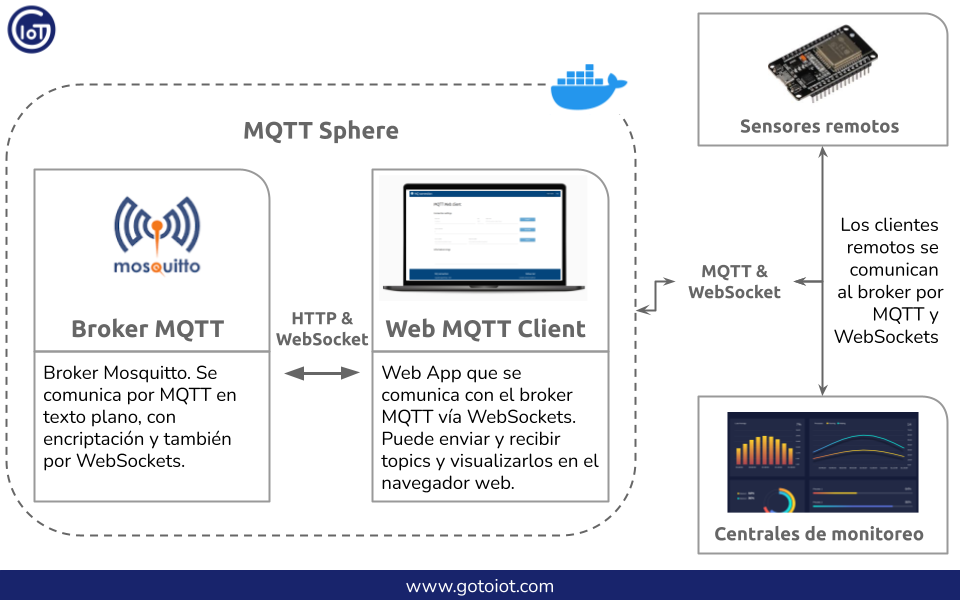

# Platform MQTT

**Autor**: Agustin Bassi - 2021

## Tabla de contenido

* [Información importante](#Información-importante)
* [Introducción](#introducción)
* [Instalar dependencias](#instalar-dependencias)
* [Descargar el código](#descargar-el-código)
* [Ejecutar la aplicación](#ejecutar-la-aplicación)
* [Colaborar](#colaborar)
* [Licencia](#licencia)

## Información importante

> Para leer artículos relacionados con tecnologías IoT visitar nuestro sitio web [helloiot.net](https://helloiot.net).

> Para ver toda la documentación de los proyectos de manera abarcativa y organizada visitar nuestra [wiki de Hello IoT](https://github.com/hello-iot/documentation/wiki).

> En caso de encontrar algún problema, comentarlo en nuestro [foro de Hello IoT](https://groups.google.com/g/helloiot) para encontrar una solución entre los miembros de la comunidad.

> Muchos de los proyectos implementados en Hello IoT utilizan Visual Studio Code como IDE de desarrollo debido a su potencia y capacidad de instalar extensiones útiles de desarrollo, por lo que se recomienda descargarlo desde [este link](https://code.visualstudio.com/download). 

## Introducción

Este proyecto es una plataforma integral IoT sobre el protocolo MQTT que se ejecuta sobre Docker Compose y que consta de varios módulos que se describen a continuación:

* **MQTT Broker**: Broker MQTT basado en Mosquitto el cual está configurado para conectarse con clientes en texto plano (puerto 1883), con autenticación (puerto 8883) y mediante WebSockets (puerto 9001).
* **Web MQTT Client**: Una Single Page Application (SPA) que se comunica con el MQTT Broker a través de Websockets. Puede enviar y recibir topics MQTT y visualizar los mensajes desde un navegador. El código del cliente web es accedido mediante un servidor web corriendo dentro de la aplicación de Docker Compose.
* **Embedded MQTT Client**: Un firmware basado en Arduino que se conecta al MQTT Broker para enviar/recibir topics y visualizar los mensajes en la terminal serie.

En la siguiente imagen se muestra un diagrama de arquitectura de la aplicación y cómo interactúan las partes entre sí:



## Instalar dependencias

Para este proyecto es necesario tener instalado Docker y Docker Compose. Ambas herramientas se pueden instalar en cualquier sistema operativo incluído Raspberry Pi OS. 

Ejecutarse sobre Docker Compose le da la capacidad de implementarse  de igual manera en cualquier sistema operativo, ya que Docker se encarga de abstraer la aplicación en containers.

Si la aplicación debe ejecutarse sobre Raspberry Pi OS, seguir los pasos de instalación en Docker y Docker Compose en [este link](https://devdojo.com/bobbyiliev/how-to-install-docker-and-docker-compose-on-raspberry-pi). 

En caso contrario, primero instalar Docker desde la [documentación oficial](https://docs.docker.com/get-docker/), y luego instalar Docker Compose desde la la [documentación oficial](https://docs.docker.com/compose/install/).


## Descargar el código

Desde la esquina superior derecha en [la home de este repositorio](https://github.com/hello-iot/platform-mqtt) realizar un `fork` a la cuenta personal. Una vez realizado el fork descargar el código con el siguiente comando (poner el usuario de github en la URL):

```
git clone https://github.com/USER/web-mqtt-client.git
```

> En caso de no poseer una cuenta de Github se puede realizar un `clone` directo de este repositorio.

Luego descargar los módulos del proyecto con el siguiente comando:

```
git submodule update --init --recursive --remote
```

Abrir la carpeta del proyecto desde VS Code luego de la descarga.

## Ejecutar la aplicación

Una vez que las dependencias están instaladas y el código descargado es momento de correr la aplicación. En la raíz del proyecto ejecutar el siguiente comando que se encargará de descargar las imágenes de Docker correspondientes y las ejecutará de la manera que se especifica en el archivo `docker-compose.yml`:

```
docker-compose up
```

Acceder al Web MQTT Client abriendo [http://localhost:5001/](http://localhost:5001/) en el navegador (en caso de acceder de manera remota, cambiar `localhost` por la IP del host remoto).

Si el Web MQTT Client pudo accederse significa que la aplicación se encuentra corriendo adecuadamente.

### Comunicación con Web MQTT Client

Para testear que la comunicación entre el MQTT Broker y el Web MQTT Client funcione correctamente, dentro de la aplicación realizar las siguientes configuraciones:

1. Configurar la IP y el puerto del host MQTT  y un nombre de cliente en los campos `MQTT host`, `MQTT port` y `MQTT Client` y presionar el botón `CONNECT`.
2. Configurar un `Topic to subscribe` y presionar el boton `SUBSCRIBE` para recibir mensajes desde el broker (por defecto todos los topics '#').
3. Configurar un topic y un payload en los campos `Topic to publish` y `Payload to publish` y presionar el botón `PUBLISH` para enviar el topic al broker. 

Como el cliente ya se encuentra suscripto a todos los topics, en la sección `Logs` aparecerá el topic publicado a modo de `echo`. En la siguiente figura hay una demostración de las configuraciones necesarias.


### Comunicación con Embedded MQTT Client

Para probar la comunicación entre el MQTT Broker y el Embedded MQTT Client será necesario configurar PlatformIO dentro de Visual Studio Code y luego realizar las configuraciones de WiFi y el host MQTT tal como se indica dentro del [README de embedded-mqtt-client](./embedded-mqtt-client/README.md).

Una vez que el Embedded MQTT Client esté "enviando mediciones" de presión hacia el broker y se realice la visualización de tales mensajes dentro del Web MQTT Client, desde el cliente web publicar el topic `mqtt-client-001/config/publish_time` con un valor entre 1000 y 10000 (en ms). Esto cambiará el período con que el dispositivo publica los topics entre 1-10 segundos. Chequear que efectivamente cambie el período al enviar esos valores.

## Colaborar

Las mejoras son bienvenidas. Para ello es necesario hacer un fork de este proyecto, aplicar las mejoras y enviarlas mediante un pull request. Luego de la revisión, podrán ser incluídas.

Si te gustó el proyecto no dudes en apoyarlo con una `Star`, y si estás interesado en recibir novedades podés aplicar un `Watch`. Estas acciones ayudan a fomentar la participación y creación de nuevos proyectos dentro de [Hello IoT](https://github.com/hello-iot/).

## Licencia

[MIT](https://choosealicense.com/licenses/mit/)

